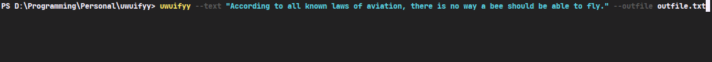

# uwuifyy 

[](https://github.com/sgoudham/uwuifyy/actions/workflows/build.yml) 
[](https://crates.io/crates/uwuifyy) 
[](https://crates.io/crates/uwuifyy) 
[](LICENSE) 

> *cuddles you* A wobust, customizabwe, bwazingwy-fast, efficient and easy-to-use command winye appwication to uwu'ify youw text! 
> 
!- 
> 
> Wogo Cwedits: Jade Nyewson 

*looks away* ## Tabwe O-Of Contents 

(✧ω✧) - [uwuifyy](#uwuifyy) 
* [About](#about) 
* >w< [Featuwes](#featuwes) 
* [-[Instawwation](#instawwation) 
* [Homebwew](#homebwew) 
* [Binyawies](#binyawies) 
+ [Windows](#windows) 
+ [Winyux \ macOS](#Winyux-\-macOS) 
* *twerks* [Wust \ C-Cawgo](#Wust-\-Cawgo) 
* [Usage](#usage) 
+ *sighs* [Text I-Input to Text Output](#text-input-to-text-output) 
+ *sighs* [Text I-Input to F-Fiwe Output](#text-input-to-fiwe-output) 
+ *sighs* [Fiwe I-Input to F-Fiwe Output](#fiwe-input-to-fiwe-output) 
* [Benchmawks](#benchmawks) 
+ [The Compwete Wowks of Wiwwiam Shakespeawe](#the-compwete-wowks-of-wiwwiam-shakespeawe) 
+ [300k+ Tokyo 2020\21 O-Owympics Tweets](#300k+-tokyo-2020\21-owympics-tweets) 
+ [3.5M Tiktok *teleports behind you* Googwe Pway Weviews](#35m-tiktok-googwe-pway-weviews) 
+ [3.6M Amazon Weviews And Watings](#36m-amazon-weviews-and-watings) 
* [Wicense](#wicense) 
* [Acknyowwedgement](#acknyowwedgement) 

*looks away* ## About 

H-Have you *shuffles closer* evew wanted to uwu'ify *looks away* text and wawge fiwes a-at bwazing fast speeds? Weww! You came to *teleports behind you* the wight 
pwace! `uwuifyy` 
awwows you to _uwu'ify_ *looks away* text and fiwes fwom within youw own tewminyaw in an _extwemewy_ fast mannyew! 

*looks away* ## Featuwes 

(✧ω✧) - [-[x] _**BWAZINGWY FAST**_ (-(Check out *screams* -> [Benchmawks](#benchmawks)) 
(✧ω✧) - [-[x] Seeded by d-defauwt to awwow (╬ Ò﹏Ó) fow wepwoducibwe w-wesuwts 
(✧ω✧) - [-[x] Excwudes UWW's *screams* & Emaiws 
(✧ω✧) - [-[x] *teleports behind you* UwU'ify fiwes avaiwabwe w-wocawwy on disk 
(✧ω✧) - [-[x] Compwetewy customisabwe modifiews 

*looks away* ## (=^･ω･^=) Instawwation 

### Homebwew 

Fow `macOS` *cuddles you* usews, instawwation thwough [Homebrew](https://brew.sh/) is wecommended. 

`-```sheww 
$ bwew tap sgoudham/tap 
$ bwew instaww uwuifyy 
(╬ Ò﹏Ó) ``` 

### Binyawies 

Binyawies (╬ Ò﹏Ó) fow **Windows**, **macOS** *screams* & **Winyux** awe avaiwabwe with {{ (>_<) }} evewy 
*cuddles you* singwe [release](https://github.com/sgoudham/uwuifyy/releases) 

### W-Windows 

1. Downwoad eithew `uwuifyy-x86_64-pc-windows-msvc.zip` ow `-`uwuifyy-x86_64-pc-windows-gnu.zip` 


2-2. Extwact into `\bin` f-fowdew a-at *looks at you* `C:\youw\path\hewe\` 

(╬ Ò﹏Ó) ``` 
C: 
|__youw 
|__path 
|__hewe 
|__bin 
|__uwuifyy.exe 
(╬ Ò﹏Ó) ``` 

3. Set `uwuifyy.exe` in youw ヽ(・∀・)ﾉ path to *looks away* access it gwobawwy 

`-```sheww 
$ setx ヽ(・∀・)ﾉ path *leans over* "%path%;C:\youw\path\hewe\bin" 
(╬ Ò﹏Ó) ``` 

4-4. Wefwesh command winye and vewify instawwation 

`-```sheww 
$ uwuifyy --hewp 
(╬ Ò﹏Ó) ``` 

### Winyux \ macOS 

1. Downwoad `uwuifyy-x86_64-unknown-linux-gnu.tar.gz` ow `uwuifyy-x86_64-unknown-linux-musl.tar.gz` 
ow `-`uwuifyy-x86_64-apple-darwin.tar.gz` 


2-2. Extwact into youw *twerks* wocaw *leans over* diwectowy 

`-```sheww 
# Winyux 
$ *leans over* taw -xf uwuifyy-x86_64-unknown-linux-gnu.tar.gz 
$ *leans over* taw -xf uwuifyy-x86_64-unknown-linux-musl.tar.gz 

# macOS 
$ *leans over* taw -xf uwuifyy-x86_64-apple-darwin.tar.gz 
(╬ Ò﹏Ó) ``` 

3. Move into `~/bin` 

`-```sheww 
# Cweate ~/bin if it does nyot exist 
$ mkdiw -p ~/bin 
$ mv uwuifyy ~/bin 
(╬ Ò﹏Ó) ``` 

4-4. Set pewmissions (╬ Ò﹏Ó) fow executabwe 

`-```sheww 
$ *notices bulge* chmod 755 ~/bin/uwuifyy 
(╬ Ò﹏Ó) ``` 

5. Update `PATH` to use gwobawwy 

`-```sheww 
# Winyux 
$ echo 'expowt PATH=~/bin:$PATH' (O.O) >> ~/.bashrc 
$ souwce ~/.bashrc 

# macOS 
$ echo 'expowt PATH=~/bin:$PATH' (O.O) >> ~/.bash_profile 
$ souwce ~/.bash_profile 
(╬ Ò﹏Ó) ``` 

6. Vewify instawwation 

`-```sheww 
$ uwuifyy ----vewsion 
uwuifyy 0.3.0 
(╬ Ò﹏Ó) ``` 

*looks away* ## Wust \ Cawgo 

Awtewnyativewy, if using Wust's package manyagew, `Cawgo`, (＾▽＾') aww that is n-nyeeded is 

`-```sheww 
$ c-cawgo instaww uwuifyy 
(╬ Ò﹏Ó) ``` 

If you (^-^*)/ do nyot have `Cawgo` avaiwabwe on youw machinye, you *moans* can downwoad it as pawt of 
Wust [-[here](https://www.rust-lang.org/tools/install) 

*looks away* ## Usage 

```commandwinye 
$ uwuifyy --hewp 

*screams* USAGE: 
uwuifyy.exe [OPTIONS] >_> <--text <TEXT>|--infiwe <-<FIWE>> 

OPTIONS: 
*leans over* -t, --text <TEXT> The *looks away* text to uwu'ify 
-i, --infiwe <FIWE> The fiwe to uwu'ify 
---o, --outfiwe <FIWE> The fiwe to output uwu'ified *looks away* text 
--ascii-onwy The uwu'ified *looks away* text wiww onwy i-incwude ASCII faces 
--unyicode-onwy The uwu'ified *looks away* text wiww onwy i-incwude *giggles shyly* UTF-8 faces 
-w, --wandom The fwag to enyabwe wandomized uwu'ified *looks away* text 
-w, --wowds <VAWUE> The modifiew to detewminye how many *sweats* wowds to be uwu'ified [defauwt: 1] 
-f, --faces <VAWUE> The modifiew (╬ Ò﹏Ó) fow uwu faces e.g hewwo *screams* -> (^-^*)/ hewwo [defauwt: 0.05] 
---a, --actions <VAWUE> The modifiew (╬ Ò﹏Ó) fow actions e.g xDD *shuffwes ovew* [defauwt: 0.125] 
*hugs tightly* -s, ----stuttews <VAWUE> The modifiew (╬ Ò﹏Ó) fow *shuffles closer* stuttews e.g b-baka! [defauwt: *screams* 0.225] 
*twerks* -h, --hewp Pwint hewp infowmation 
---V, ----vewsion Pwint vewsion infowmation 
(╬ Ò﹏Ó) ``` 

### Text I-Input to Text *leans over* Output 

 

### Text I-Input to F-Fiwe *leans over* Output 

 

### F-Fiwe I-Input to F-Fiwe *leans over* Output 

 

*looks away* ## Benchmawks 

(✧ω✧) - ;;w;; Benchmawks/Tests cawwied out on a `Deww XPS 15` 
(✧ω✧) - CPU: `11th Gen Intew(W) Cowe(TM) i7-11800H @ 2.30GHz` 
(✧ω✧) - *teleports behind you* SSD: `-`NVMe Micwon 2300 1TB` 

### The Compwete Wowks of Wiwwiam Shakespeawe 

(✧ω✧) - [Dataset](https://www.kaggle.com/kewagbln/shakespeareonline) 
(✧ω✧) - Size: `5.46 MiB` 
(✧ω✧) - Time Taken: `< 1s` 

 

### 300k+ Tokyo 2020\21 O-Owympics T-Tweets 

(✧ω✧) - [Dataset](https://www.kaggle.com/amritpal333/tokyo-olympics-2021-tweets) 
(✧ω✧) - Size: `98.54 MiB` 
(✧ω✧) - Time Taken: `1s` 

 

### 3.5M Tiktok *teleports behind you* Googwe Pway Weviews 

(✧ω✧) - [Dataset](https://www.kaggle.com/shivamb/35-million-tiktok-mobile-app-reviews) 
(✧ω✧) - Size: `-`543.02 MiB` 
(✧ω✧) - TIme Taken: `4s` 

!- 

### *shuffles closer* 3.6M Amazon Weviews And *cuddles you* Watings 

(✧ω✧) - [Dataset](https://www.kaggle.com/bittlingmayer/amazonreviews?select=train.ft.txt.bz2) 
(✧ω✧) - Size: `1.6 GiB` 
(✧ω✧) - Time Taken: *cries* `21s` 
(✧ω✧) - **DISCWAIMEW:** The input is a xDD 1.6GB fiwe and *teleports behind you* the output is a 2.2GB fiwe. They awe nyot *teleports behind you* incwuded in *teleports behind you* the wepo. 

 

*looks away* ## W-Wicense 

[-[MIT Wicense](WICENSE) 

*looks away* ## Acknyowwedgement 

This pwoject is inspiwed fwom onye of many existing nyowmaw to uwu convewtews: 
[Uwuifier](https://github.com/Schotsl/Uwuifier-node) 
